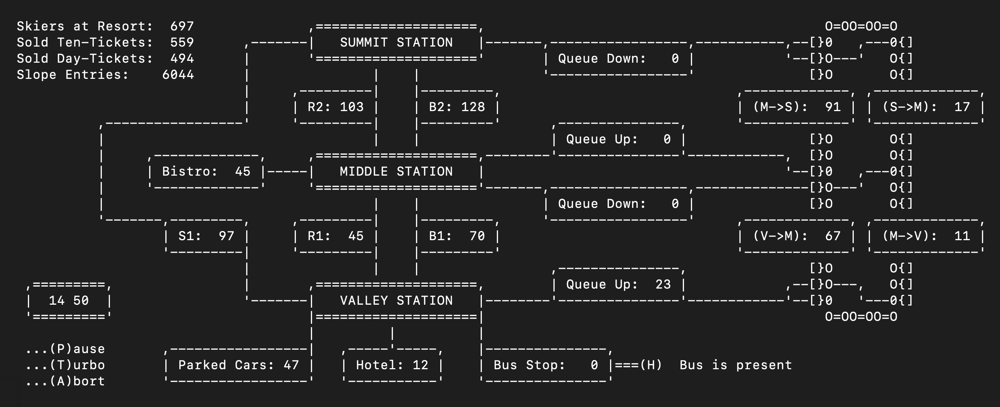

# 🎿 Ski Resort Simulator

    [](https://github.com/fseckel-develop/sim-skiresort-dataflow/actions/workflows/ci.yml)

The **Ski Resort Simulator** is a console-based application that models the visitor flow in an arbitrary skiing resort. The system is implemented in **C**, focusing on **dynamic data handling**, **pointer-based architecture**, and **explicit memory management**.  
The simulation follows a full day at the resort with interacting systems such as the lift, slopes, stations, queues, transportation, and visitor behaviour — all driven by time and probabilistic decision-making.

---
## ✨ Key Features

- Full-day simulation of a ski resort (08:40 → 22:20)
- Real-time evolving system with:
    - lift operations (110 gondolas, continuous movement)
    - skier routing and behaviour
    - queues and boarding logic
- Multiple arrival and departure systems:
    - bus (scheduled)
    - car park (capacity-based)
    - hotel guests
- Ticket system:
    - **10-ride tickets**
    - **day tickets**
- Bistro with limited stay and realistic behaviour
- Pseudo-graphical console output showing:
    - queue lengths
    - slope usage
    - lift occupancy
    - visitor count
    - ticket sales
    - parking and bus status
- Interactive controls:
    - pause / resume
    - turbo mode (×10 speed)
    - abort simulation

---
## 🖥️ Console Output / Demonstration

The simulation provides a pseudo-graphical dashboard that updates in real time.

It visualises:

- lift movement and occupancy
- slope usage
- lift queue sizes
- visitor statistics
- system state



The actual output is continuously updated and rendered in-place to simulate a live dashboard.

---
## 🚀 Running the Simulation

#### Requirements:
- C compiler (e.g. `gcc`, `clang`)
- CMake ≥ 3.10

#### Build:
```shell
cmake -S . -B build
cmake --build build
```

#### Run:
```shell
./build/app/main
```

---
## 🏗 Architecture

The system is structured into modular components with clear responsibilities.

Core Principles:

- Struct-based design (no OOP abstractions available in C)
- Explicit memory ownership
- Pointer-driven data flow
- Time-step simulation loop

Each simulation tick:

1. arrivals are processed
2. lift movement and exits occur
3. skiers progress on slopes
4. bistro activity updates
5. queues and boarding are handled
6. departures are processed

---
## 🧠 Design Focus

**Pointer-Based Architecture**:

- Entities are interconnected via pointers
- No global state — everything is explicitly passed

**Manual Memory Management**:

- Controlled allocation (calloc)
- Deterministic cleanup (destroy_*)
- Clear ownership boundaries

**Custom Data Structures**:

- Doubly linked lists
- Queues
- Circular linked gondola system

**Probabilistic Simulation**:

- Uniform, normal, and log-normal distributions
- Used for:
    - arrivals and departures
    - activity durations (skiing, eating at bistro, resting at hotel)
    - routing decisions
    - ticket selection

---
## 🗃️ Project Structure

```text
.
├── app/                → Entry point (main.c)
├── include/skiresort   → Public headers
├── src/                → Implementation
├── tests/              → Unit tests
├── docs/               → Reference material
├── CMakeLists.txt
└── README.md
```

### Module Overview

Core Simulation:

- central control loop and time progression
- `simulation`, `resort`, `clock`

Infrastructure & Flow Logic:

- routing logic and state transitions of people
- `station`, `lift_queue`

Entities:

- moving actors and transport containers
- `person`, `gondola`

Environment:

- physical resort components and activity spaces
- `lift`, `slope`, `bistro`, `hotel`

Transport Systems:

- arrival and departure mechanisms
- `bus`, `bus_stop`, `car`, `car_park`

Data Structures:

- custom dynamic data structures
- `list`, `queue`, `node`

Utilities:

- randomness and user interaction
- `probability`, `input`

---
## 🧪 Testing

The project includes a comprehensive suite of unit tests, using static assertions to verify correctness and invariants. They cover:

- data structures (List, Queue, Node)
- memory handling
- scheduling logic
- probabilistic behaviour
- system interactions

#### Build tests:
```shell
cmake -S . -B build
cmake --build build
```

#### Run all tests:
```shell
ctest --test-dir build
```

#### Run specific test (example):
```shell
ctest -R list_tests --test-dir build
```

---
## 🎯 What This Project Demonstrates

- System modelling in pure C
- Robust dynamic memory handling
- Pointer-based architecture
- Simulation of complex interacting systems
- Modular design without object-oriented abstractions
- Realistic behaviour through probabilistic modelling
- Clear separation of responsibilities across modules

---
## 🙌 Get Involved

Feel free to:

- Explore the simulation logic
- Extend system behaviour
- Add new features (e.g. weather, pricing, AI)
- Use the project as a reference for systems programming in C

---
### Thanks for Visiting!

This project demonstrates how complex, dynamic systems can be built in pure C using clean structure, careful memory management, and well-defined data flow.

Happy coding! 🚀
